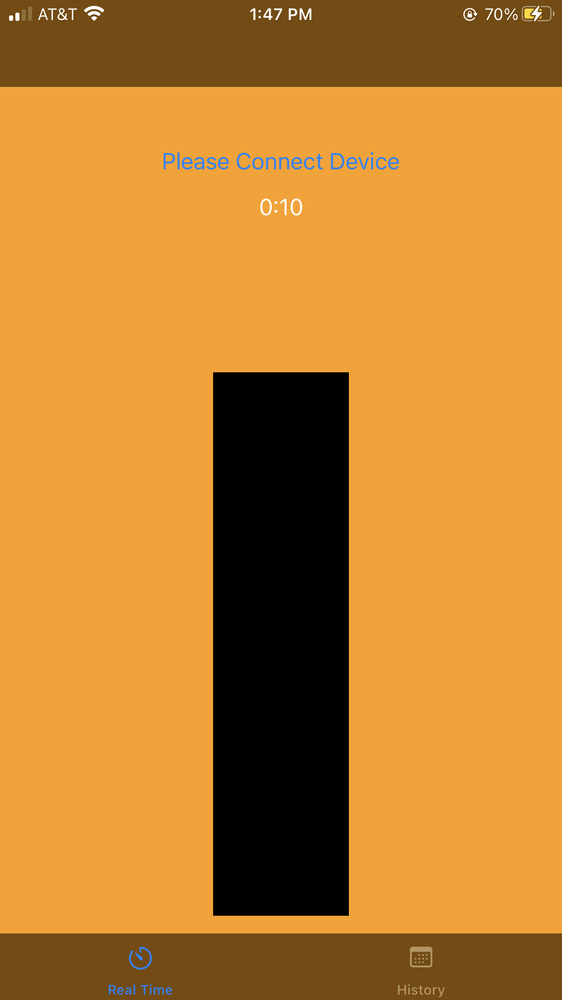
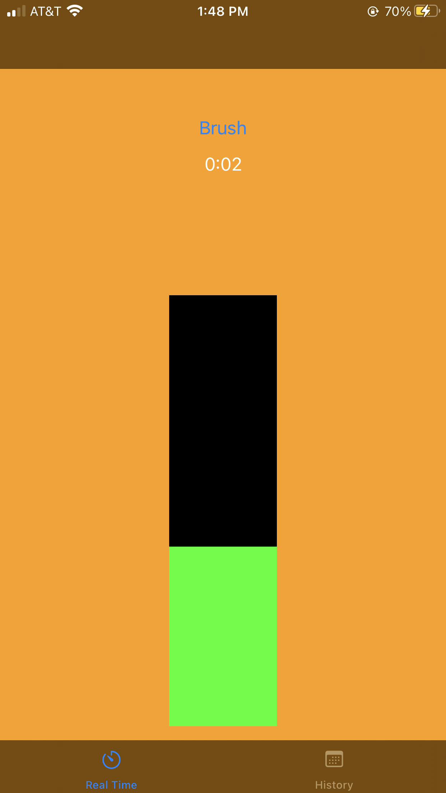
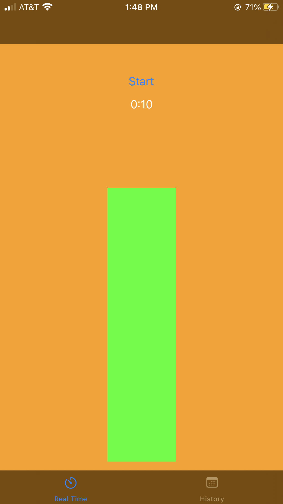
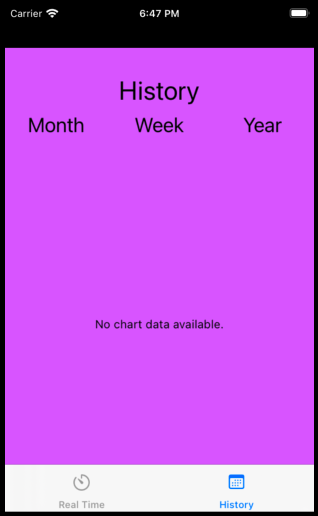
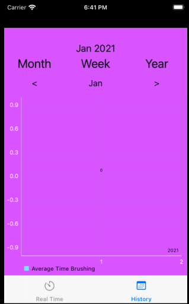
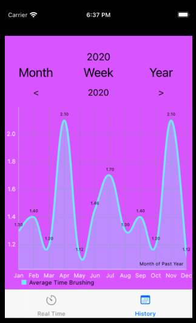

# ios-app

Updated 10/23 for CS275 project deliverable 2, interim updated. 

This is a proof of concept design for connecting a Arduino BLE nano to an iphone using Bluetooth. The Purpose of the app is to collect acceleromater data from the integrated IMU on the Arduino and display an "accomplishment" bar to the user. The user's goal is to move the arduino to fill the bar to completion. An application of this could be tracking a user brushing their teeth. In this example, the movement would loosely corespond to active tooth brushing motion. 

In this code, there are a few main components. First, the [Bluetooth Connection](#bluetooth-connection) to the iPhone was the biggest risk. Once the device is connected, the user will see the [Real Time Display](#real-time-display). After a session, the data will be stored in the [Local Database](#database-connection). To view preivous data, the user can use the navigation bar to go to the [History View](#history-view-of-previous-data) and select timeframes to view data. See the following sections for more information on each component.

**Video of App In Action**: [https://youtu.be/w4ySSXS8Hbc](https://youtu.be/w4ySSXS8Hbc)

## Bluetooth Connection

The bluetooth connection is accomplished using a CB Delegate object in swift. This allow the bluetooth service on the phone to connect to external devices. Per iOS guidelines, the user needs to be prompted when these types of services are active. On first startup, the user will be prompted to activate bluetooth if it is not already on. Then the app will automatically connect to the Arduino UID based on a hard coded value. 

On the Arduino side of the project, the arduino connects to the phone through the integrated bluetooth nRF52840 chip set. The arduino has a built in 9 axis IMU. This project is only reading the X, Y, Z axis of the accelerometer to approximate motion. The bluetooth service sends a value along with a notification that a value has updated. This allow for the iOS app to know when values change and update appropirately. 

## Real Time Display

This view handles the connection, timing, and total bursh movement for a session.

The text at the top of the screen shows the connection status. A device can simply be connected by turning on the bluetooth on the phone, SmartBrush will then automatically find and connect to the arduino.

If the arduino is connected to the phone then the status label will change to a start button. When pressed this button will start a timer and start reading in and values from the arudino and fill in the black bar from the bottom.

The more movement that is read the more the bar will fill up until the top of the meter is reached.

Once the timer ends the data which has been collected will be inserted into the database.

## Database Connection
For this project, the database framework used is SQLite. The database stores ToothBrushData values each having an average, month, day, time, year
day of week, and number of days in month fields. The month, day, time, and year fields record the date and time the app recorded and calculated
the averages from the user in Real Time View. The database is also used in History View to fetch and graph previous averages for the user to view.

## History View of Previous Data
In the History View, the user will initially see an empty view where they can then click on any of the buttons at the top (Month, Year, Week) to 
render a graph display of the current week, month, or year of past data recorded from Real Time View and fetched from the database. 

 

If no data exists, the database will render an empty graph. 

 

If data exists, then the user will see their past data graphed. 

The user can also click the arrow buttons above the graph to flip through the weeks, months, or years to see the recorded data on those corresponding
days, weeks, months, and years. 

## Additional Libraries needed
For older versions of XCode:

In order for Charts import to work, Cocoa Pods must be installed into the XCode project. 
Here's a short video link showing you how to do so: 

https://www.youtube.com/watch?v=P0TZpkISKa8&t=72s

Thanks!

Here is a link to a demo of the app:
https://youtu.be/w4ySSXS8Hbc

## Resources
To help learn about Bluetooth, this source was used and some code was based on. [Bluetooth in Swift](https://www.raywenderlich.com/231-core-bluetooth-tutorial-for-ios-heart-rate-monitor)

For future work with sound implementation, here's one article we found. [https://www.zerotoappstore.com/how-to-add-background-music-in-swift.html](https://www.zerotoappstore.com/how-to-add-background-music-in-swift.html). The concept doesn't look too bad. You can add an mp3 file to the XCode environment and then start and end background music play at various times. 
